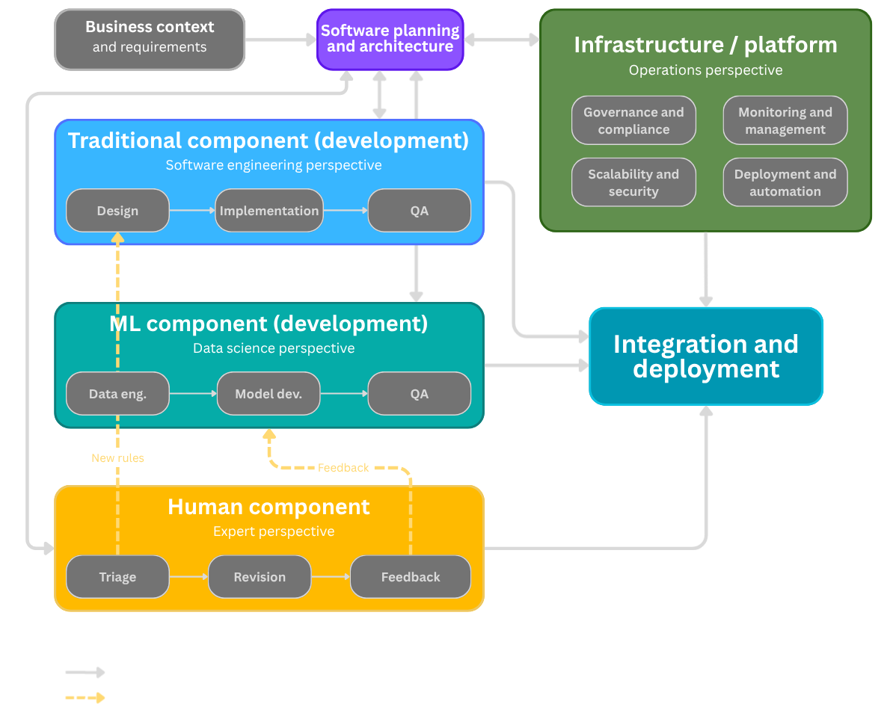
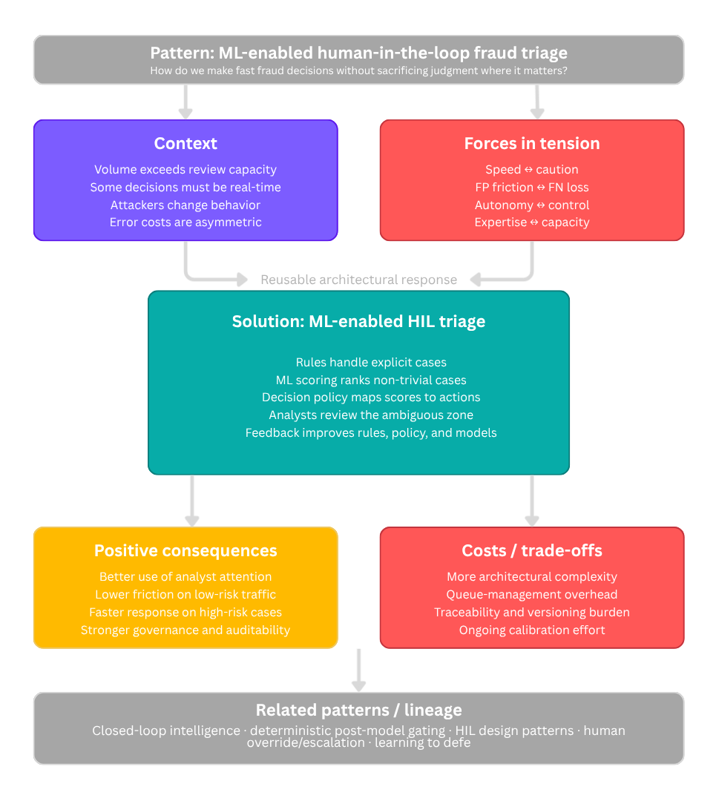
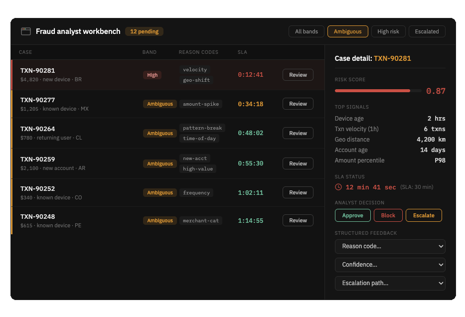
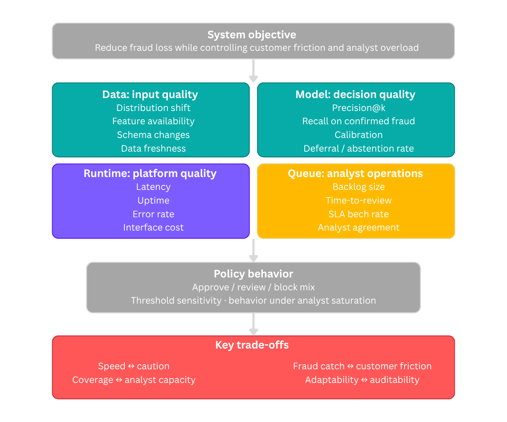
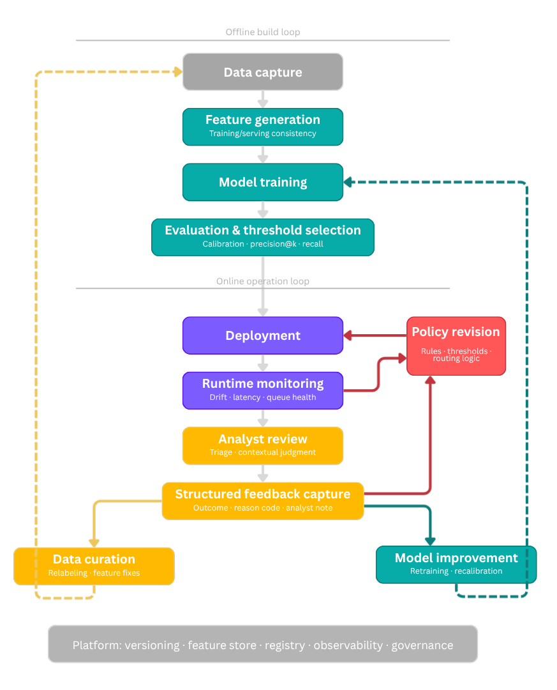

GitHub Repo: [Fraud System Architecture](https://github.com/jospablo777/fraud_ml_design_pattern)

## Abstract {.unnumbered}

Here we extend the Nerdearla Chile 2026 talk "Fraud prevention, machine learning, and design patterns: keep your analysts in the loop." Fraud prevention should be treated as an **ML-enabled software-architecture problem**, not only as a classification problem. In real operations, rules, machine learning, operational policy, analyst work, and platform engineering all shape outcomes. Looking only at model performance hides the socio-technical nature of the system.

We develop a design-pattern proposition for **ML-enabled Human-in-the-Loop (HIL) Triage**. The proposed pattern uses rules for explicit cases, machine learning for scoring and prioritization, policy for routing and action selection, and expert analysts for ambiguous cases and structured feedback. The discussion connects this architecture to the literature on software architecture for ML systems, human-in-the-loop design, design patterns for AI-based systems, learning to defer, alert prioritization, reliable machine learning, and platform engineering. More broadly, we situate the proposal within the wider human-in-the-loop machine-learning literature, where humans may participate as reviewers, collaborators, or teachers rather than only as post hoc annotators [@MosqueiraRey2023].

## Introduction

The conference talk that accompanies this repository was intentionally concise. A short slot is useful for communicating the core intuition, but it cannot fully explain the broader software-architecture background, the design-pattern framing, the operational consequences, or the connections to MLOps and platform engineering. This article exists to fill that gap.

The central thesis is straightforward: robust fraud-prevention systems are hybrid systems[^hybrid]. They rarely succeed as purely manual workflows, because the volume of traffic and the speed of attack make full manual review infeasible. They also rarely succeed as purely automatic systems, because high-stakes decisions must account for ambiguity, changing attacker behavior, incomplete labels, asymmetric costs, and governance constraints. The most resilient architecture combines deterministic controls, statistical scoring, decision policy, and expert human judgment.

[^hybrid]: **Hybrid system:** A fraud system combining deterministic rules, ML scoring, decision policy, and expert human judgment rather than relying on any single component.

That claim is not merely organizational. It is architectural[^sociotechnical]. Production machine-learning systems already require supporting software, data pipelines, monitoring, deployment structures, and cross-functional engineering practices [@Sculley2015; @Amershi2019SE; @Lewis2021Challenges; @Nazir2024]. In fraud prevention, the surrounding system also includes analysts, decision queues, escalation paths, structured review outcomes, and operational feedback loops. The unit of design is therefore not a machine learning (ML) model in isolation, but the socio-technical system in which model outputs, human judgment, workflow, and institutional decision-making interact to convert signals into action [@Dobbe2024; @Salwei2022].

[^sociotechnical]: **Socio-technical system:** A system whose behavior is shaped by both technical components (models, pipelines, infrastructure) and human work (analyst review, organizational decisions, governance).

{#fig-three-pillars}

@fig-three-pillars captures the argument in its simplest form. Fraud systems benefit from three complementary capabilities. Rules encode explicit knowledge and guardrails. Machine learning compresses heterogeneous signals into scores or rankings. Analysts contribute judgment, novelty detection, and feedback. The point of the pattern is not to declare one of those capabilities superior; it is to design their interaction well.

## Why fraud prevention becomes an architecture problem

Fraud prevention is not a stable prediction problem in which one optimizes a model once and then serves it indefinitely. In practice, fraud systems tend to combine rules, supervised models, anomaly detection, and human investigation because no single technique fully handles novelty, delayed labels, and operational constraints. @Carcillo2021 describe a typical fraud detection system as a multi-layer control structure that can include both automated and human-supervised components, while @HernandezAros2024 show that the literature still relies on a wide mix of supervised, unsupervised, deep-learning, and other approaches rather than a single dominant recipe.

First, attackers adapt[^adversarial]. @Bolton2002 already emphasized that fraud detection is a continuously evolving discipline because once a detection method becomes known, criminals change strategy. @Carcillo2021 make the same point in the credit-card setting, where customer behavior changes over time and fraudsters adapt to the detection techniques themselves. @Lunghi2023 extend this into the adversarial-learning literature, where fraud detection is treated as a security-sensitive environment shaped by concept drift, streaming constraints, limited observability, and hostile adaptation.

[^adversarial]: **Adversarial adaptation:** Fraudsters change tactics once a defense becomes known, making fraud detection a moving contest rather than a static classification task.

Second, labels are delayed and imperfect[^labeldelay]. @Carcillo2021 note that fraud labels are usually known only a posteriori, either because a customer complains or because an investigation confirms the case, and that not all labels are available immediately. @Lunghi2023 likewise describe real-world fraud detection as a delayed-feedback setting in which suspicious transactions are often analyzed by human investigators before a card is blocked. Beyond delay, the labels themselves are imperfect. Some fraudulent cases are never reported and remain wrongly labeled as legitimate, which means the training data is contaminated by undetected fraud [@Carcillo2021; @Bolton2002]. Fraud is also a heterogeneous phenomenon: although it is often treated as a binary classification problem, real fraud instances can correspond to different types of abuse, each with distinct patterns and indicators [@Bolton2002; @HernandezAros2024]. Collapsing that variety into a single positive class hides important structure that could inform detection, triage, and investigation. This means the system is not simply predicting a fixed ground truth; it is also acting inside the environment that later generates the labels used for learning, evaluation, and retraining.

[^labeldelay]: **Label delay and imperfection:** Ground truth is often confirmed only after complaints or investigations. Undetected fraud contaminates the legitimate class, and fraud itself is heterogeneous rather than a single category.

Third, error costs are asymmetric[^asymmetric]. @Bolton2002 describe fraud detection as a ranking and suspicion-scoring problem in which investigative attention must be concentrated on the most suspicious cases because it is too expensive to investigate everything. They also stress that prevention and detection involve compromises between expense, inconvenience, and effectiveness. @HernandezAros2024 similarly note that false fraud alarms, misclassification costs, and timely detection remain central practical difficulties in financial-fraud detection. In other words, the system is not optimizing a neutral statistical objective. It is managing a policy trade-off between missed harm and unnecessary friction.

[^asymmetric]: **Asymmetric error costs:** False negatives (missed fraud) cause direct loss; false positives (blocking legitimate users) cause friction and reputational damage. They are not interchangeable.

Fourth, many decisions are time-sensitive[^timesensitive]. The value of fraud detection is a function of time: the sooner the fraud is detected, the less the potential cost of the event [@Hilal2022]. @Bolton2002 argue that fraud must be detected as quickly as possible once prevention has failed, and that suspicion scores should be ranked so investigation can focus on the most urgent or suspicious records. @Lunghi2023 show that fraud detection often operates online and under streaming constraints, where timing affects both attacks and defenses. @Carcillo2021 add that real fraud systems are layered and partially human-supervised, which means architecture determines which cases can be handled automatically, which must be escalated, and how scarce analyst attention is reserved for the ambiguous zone.

[^timesensitive]: **Time sensitivity:** A correct decision made too late may still be operationally poor. The value of fraud detection is a function of time.

These properties help explain why the literature on ML-enabled software systems has moved from model-centric discussions toward more system-centric and architecture-centric thinking. @Muccini2021 argue that ML-based systems require dedicated architecting practices beyond those of traditional software alone. @Lewis2021Challenges likewise frame ML systems as end-to-end systems that must be developed, monitored, maintained, and evolved with architecture in mind, while @Nazir2024 show that current architecting guidance increasingly focuses on lifecycle, infrastructure, quality, and integration concerns rather than only on the learned component.

## From hidden technical debt to ML-enabled fraud systems

@Sculley2015 famously argued that much of the real cost of ML systems lies outside the model itself[^techdebt]. Data dependencies, feature extraction, configuration, serving, monitoring, and process tooling all create hidden technical debt. That insight is especially powerful in fraud prevention because it helps expose a misleading simplification: a fraud model is never the whole fraud system.

[^techdebt]: **Hidden technical debt:** The real cost of production ML lies mostly outside the model: data pipelines, configuration, serving, monitoring, and glue code accumulate maintenance burden.

{#fig-system-anatomy}

We adapt @Sculley2015 system-anatomy perspective to fraud operations (@fig-system-anatomy). It places the learned component inside a wider environment of data flows, serving infrastructure, process tools, monitoring, and human work. This matters because many operational failures appear at the boundaries. A feature outage, a bad integration, a misleading analyst view, or a monitoring blind spot can be just as damaging as a weak model. @Lin2013 reinforce the same lesson from large-scale data-mining infrastructure, where workflows, recurring jobs, and supporting data plumbing become first-class engineering concerns rather than background implementation details.

The same system view should shape the planning phase, not only post-deployment troubleshooting.

{#fig-planning-view}

We broaden the lens from runtime anatomy to planning in @fig-planning-view[^coarchitecting]. Business requirements, conventional software, ML development, expert review, and platform infrastructure should be designed together. @Lewis2021Challenges treat software architecture as the central organizing activity for ML-enabled systems, not as a one-time diagram produced before implementation. In that view, architecture receives business context and system requirements, decomposes the system into distinct component lanes, and coordinates how those lanes will evolve together. The bidirectional arrows are important because they show that development is not a one-way handoff. When teams encounter problems in software engineering, model development, data pipelines, quality assurance, or operations, those issues flow back to architecture so they can be discussed centrally and propagated across the rest of the system.

[^coarchitecting]: **Co-architecting:** The runtime system and the model-development pipeline should be designed together, not as disconnected work streams.

The rest of @fig-planning-view also helps clarify why ML systems must be planned as products rather than isolated models[^coversioning]. The traditional component lane represents code, APIs, business logic, integrations, and interfaces. The ML lane represents model requirements, data engineering, model development, and quality assurance, and it produces not only a trained model but also the supporting data pipeline. @Lewis2021Challenges use this planning view to motivate co-architecting and co-versioning: the system side and the model-development side must be coordinated, and the deployed model must remain traceable to the data, parameters, and evaluation artifacts that produced it. In our adaptation, the added human lane makes explicit what fraud operations often leave implicit: expert review is not an afterthought but another component that must be designed and integrated from the beginning.

[^coversioning]: **Co-versioning:** Data, features, models, evaluation artifacts, and policy thresholds should be traceable together so post-incident analysis can reconstruct the full decision state.

## Why we propose a design pattern {#sec-pattern}

The architecture discussed here is not a one-off diagram[^designpattern]. It is proposed as a reusable response to a recurring class of problems. In design-pattern terms, that means specifying context, forces, solution, and consequences [@Lakshmanan2020; @Konieczny2025].

[^designpattern]: **Design pattern:** A reusable solution to a recurring problem in a specific context. Specifies context, forces, solution, and consequences.

Pattern literature for AI and ML systems is still maturing[^mlpatterns]. @Washizaki2020 documented recurring architecture and design patterns for machine-learning systems. @Heiland2023 expanded the pattern repository for AI-based systems. @Jarvenpaa2024 focused on reusable architectural tactics for ML-enabled systems. @Cruz2023 reinforced the importance of architecture rationale and evaluation. Taken together, these works suggest that teams need more explicit and reusable architecture knowledge for ML-enabled systems.

[^mlpatterns]: **ML architecture patterns:** Washizaki et al. identified 33 ML patterns and anti-patterns. Heiland et al. expanded this to 70 AI-system patterns.

@Andersen2024 make that point especially concrete for human-in-the-loop settings[^hilpatterns]: they frame HIL as a software-engineering design space and compile a catalog of reusable HIL patterns spanning data preparation, training, operation, monitoring, and explanation. Their work is particularly relevant here because it shows that human participation can itself be treated as a pattern concern rather than as an informal fallback around an otherwise automated model.

[^hilpatterns]: **HIL patterns:** Andersen & Maalej catalog reusable human-in-the-loop patterns for ML systems spanning data preparation, training, operation, monitoring, and explanation.

That is exactly the motivation for formalizing an ML-enabled HIL triage pattern for fraud[^hitlml]. The broader HIL-ML literature strengthens that move. @MosqueiraRey2023 describe human-in-the-loop machine learning as a family of approaches, including active learning, interactive machine learning, and machine teaching, that differ in how human expertise enters and shapes the loop. Fraud operations are closer to that richer view than to a narrow image of humans appearing only after the system has already made a decision. @Andersen2024 also help make the operational implication clearer: HIL is not limited to model training, but extends into deployed-system patterns such as recommendation support, active moderation, corrective feedback, continuous learning, and explanation.

[^hitlml]: **HITL-ML family:** Includes active learning, interactive ML, and machine teaching. Differs in *how* and *when* human expertise enters the loop.

{#fig-pattern-card}

We summarize that pattern view in @fig-pattern-card. The relevant context is a fraud operation in which review demand exceeds analyst capacity, some cases require real-time action, attackers adapt, and error costs are asymmetric [@Bolton2002; @Carcillo2021; @Jalalvand2024; @Ghadermazi2024]. The forces in tension include speed versus caution, customer friction versus missed fraud, autonomy versus control, and expertise versus capacity [@Bolton2002; @Jalalvand2024; @Alves2025]. The reusable solution is to combine rules, scoring, policy, analyst review, and feedback loops [@MosqueiraRey2023; @Andersen2024]. The costs include architectural complexity, calibration work, queue-management overhead, and traceability or versioning obligations [@Lewis2021Challenges; @Cruz2023; @Nazir2024].

This framing is useful because it turns the talk from a general exhortation into a reusable architectural idea. Forces and consequences are not decorative labels, but a way of making trade-offs explicit in context, which is central to architectural reasoning [@Richards2025].

## The anatomy of the proposed pattern {#sec-anatomy}

The proposed pattern can be understood as a series of transformations that move from signal to action.

The first important transformation is from observation to score[^scorepolicy]. The model consumes features and estimates risk. The second is from score to policy. A separate policy layer interprets the score in light of operational goals and constraints. The third is from policy to action, where the system approves, blocks, escalates, or routes a case to review (@fig-score-policy-action).

[^scorepolicy]: **Score ≠ decision:** The model produces a risk estimate. A separate policy layer translates that estimate into operational action under business constraints.

{#fig-score-policy-action}

This separation is essential, it avoids the common but dangerous shortcut of treating the model score as if it were already a business decision [@Chen2022]. In operational settings, scores often need to be combined with guardrails, analyst saturation, time sensitivity, customer value, regional policy, and legal requirements [@Ghadermazi2024; @Jalalvand2024; @Kaestner2025]. Those are policy concerns, not model parameters.

Once score and policy are separated, the architecture can be stated more precisely[^l2d].

[^l2d]: **Learning to defer (L2D):** A framework where the system decides whether to handle a case automatically or route it to a human expert, based on who is more likely to be correct.

{#fig-reference-architecture}

@fig-reference-architecture summarizes that runtime logic as a reference pattern. Deterministic rules sit near the entry point because some cases are explicit enough to justify immediate handling. Non-trivial cases reach the scoring layer. The policy layer then converts score into action. Low-risk cases may be approved automatically to reduce friction. Clear high-risk cases may be mitigated automatically. Ambiguous cases move to analysts.

This structure has several advantages. It respects the strengths of each component, it separates inference from governance, and it creates a natural place to encode escalation logic. It also aligns well with the broader literature on learning to defer and selective intervention, where the goal is not merely to classify but to decide which cases should stay with the model and which should be routed to experts [@Alves2025].

## Analysts are a runtime component, not a fallback afterthought

A recurring weakness in ML system design is to treat human review as a vague fallback step[^analystcomp]. The pattern proposed here argues for the opposite. Analysts should be considered explicit runtime components of the architecture.

[^analystcomp]: **Analyst as component:** Human review is not an exception handler. It is a designed workflow with structured inputs (ranked cases, reason codes) and structured outputs (decisions, feedback).

{#fig-bidirectional}

We represent that relationship in @fig-bidirectional as a two-way collaboration. The model accelerates prioritization and reduces search cost. Analysts supply interpretation, exception handling, escalation judgment, and feedback. That feedback is not just an annotation activity for offline training. It is part of the production operation. Seen through the HIL literature, analysts are not merely annotators. They may act as reviewers, collaborators, or teachers depending on where intervention happens and how their expertise is captured [@MosqueiraRey2023]. Related work on anomaly reasoning and management reaches a similar conclusion from the tooling side: the goal is not detection alone, but support for explanation, action, and iterative investigation in production [@Ding2023].

{#fig-feedback-architecture}

Analyst outcomes should feed both rule maintenance and model improvement[^feedbackprop]. That means review results must be structured enough to support relabeling, rule creation, threshold changes, and post-incident analysis. @Kadam2024 helps sharpen this point by treating human-in-the-loop fraud feedback not only as ad hoc review, but as feedback that can be propagated and reused. This is especially important when the system encounters weakly characterized or unknown attacks[^openset]. Expert-in-the-loop approaches to open-set recognition suggest that human review becomes most valuable at the boundary where the model faces novelty and uncertainty rather than well understood cases [@Yuan2026].

[^feedbackprop]: **Feedback propagation:** Kadam (2024) shows that even sparse analyst annotations can improve fraud models when propagated through a transaction graph to related observations.

[^openset]: **Open-set recognition:** Detecting cases that don't belong to any known class. Human review is most valuable here, at the boundary of model knowledge.

In @fig-feedback-architecture, the yellow return paths from automatic approval and automatic pressure to the human-analyst box make that point more explicit[^retrospective]. Analysts should not review only the ambiguous cases routed to them in real time. They should also be able to audit samples of cases that were automatically resolved on either side, both to detect false positives and false negatives and to decide whether the underlying label, threshold, rule, or routing logic should be revised [@Tan2026; @Chen2022]. Structured review of automatically handled cases can then be turned into corrections or additional labels [@Andersen2024]. In fraud settings, @Kadam2024 makes the same idea more concrete by showing that human feedback can be propagated and reused, improving robustness, recall, and performance on unseen fraud patterns. When those reviewed outcomes are captured carefully, they also improve relabeling quality and strengthen future training data [@Chen2022].

[^retrospective]: **Retrospective audit:** Analysts should also review samples of automatically resolved cases to catch false positives/negatives and revise thresholds, rules, or routing logic.

{#fig-operative-learning}

At its simplest, the pattern is an operating loop rather than a pipeline (@fig-operative-learning). The system should not end with action alone. Once outcomes are observed, feedback should flow back into both rules and models so that operations become a source of learning.

Operationalization also requires a concrete analyst workbench[^workbench].

[^workbench]: **Analyst workbench:** An operational interface showing ranked cases, risk bands, reason codes, SLA timers, action controls, and structured feedback fields.

{#fig-analyst-workbench}

A workbench like the one shown in @fig-analyst-workbench turns the architecture into an operational review system. Alert prioritization research repeatedly highlights the importance of workload, context, skill, assignment, and review efficiency [@Ghadermazi2024; @Jalalvand2024]. Learning-to-defer research likewise shows that expert availability and heterogeneity matter for system performance [@Alves2025]. A practical analyst interface should therefore expose ranked cases, top signals, SLA pressure, action controls, and structured feedback fields. Without those elements, the architecture remains abstract and difficult to operate. This is also consistent with human-AI interaction guidance, which emphasizes communicating uncertainty, supporting efficient oversight, and making intervention understandable at the point of use [@Amershi2019HAI]. Industry case studies point in the same direction. Uber's Project RADAR used humans in the loop to validate and operationalize candidate fraud rules rather than treating analysts as a purely manual backup layer [@Zelvenskiy2022].

## Evaluation must fit the socio-technical system

One of the strongest consequences of the architecture view is that evaluation has to widen[^fourlayers] [@Lewis2021Challenges; @Nazir2024]. A system that routes decisions across automation and human review should not be judged only with a single model metric, because the relevant unit of evaluation is the broader socio-technical system in which model outputs interact with workflow, human interpretation, and organizational action [@Dobbe2024]. ML is one element inside a larger work system, and evaluating the ML component in isolation misses the interactions that determine real outcomes [@Salwei2022].

[^fourlayers]: **Four evaluation layers:** (1) Data/input quality, (2) model/decision quality, (3) queue/analyst operations, (4) runtime/platform quality. Plus policy behavior and trade-offs.

{#fig-metrics-framework}

Taken together, these dimensions define a broader evaluation frame (@fig-metrics-framework), one that reflects not only model behavior but also the wider socio-technical conditions under which the system is used and interpreted [@Dobbe2024; @Fazelpour2025]. Data and input quality matter because distribution shifts, missing features, or stale inputs can damage performance before the model even acts [@Lewis2021Challenges; @Chen2022; @Kaestner2025]. Model and decision quality still matter, but metrics such as precision at the top of the queue[^precisionk], recall on confirmed fraud, calibration, and deferral rate[^deferral] are often more informative than a single aggregate score [@Chen2022; @Alves2025].

[^precisionk]: **Precision@k:** Precision among the top-*k* ranked cases in the review queue. More operationally relevant than overall precision when analyst capacity is finite.
[^deferral]: **Deferral rate:** The fraction of cases the system routes to human review rather than handling automatically. A key tuning parameter for analyst workload.

Queue and analyst operations matter because backlog size, review latency, agreement, workload, and SLA behavior shape the system's real effectiveness in practice [@Jalalvand2024; @Ghadermazi2024; @Alves2025]. Runtime and platform quality matter because latency, error rates, uptime, and observability determine whether the decision system remains usable in production [@Lewis2021Challenges; @Tan2026].

The policy box in @fig-metrics-framework is equally important[^policy]. Approval, review, and block rates are not only downstream consequences of the model. They are part of what the organization is deliberately choosing through its operating policy [@Chen2022]. This is another reason score and policy should be treated separately [@Lewis2021Challenges; @Kaestner2025].

[^policy]: **Policy behavior:** The approve/review/block traffic split is not just a model output — it is an organizational choice. Threshold sensitivity and saturation behavior are policy metrics.

The trade-off strip at the bottom is not decorative. It reflects the fact that fraud systems move along architectural and operational frontiers rather than optimizing a single objective [@Fazelpour2025]. Speed can conflict with caution, fraud catch rate with customer friction, coverage with analyst capacity, and adaptability with auditability [@Chen2022; @Jalalvand2024; @Alves2025]. Architecting ML-enabled systems requires making these trade-offs explicit [@Lewis2021Challenges; @Nazir2024; @Cruz2023; @Kaestner2025; @Richards2025].

## MLOps and platform engineering are part of the argument

The pattern does not end at runtime routing[^mlops]. It has an operational lifecycle in which monitoring and user feedback inform model maintenance and evolution, including retraining [@Lewis2021Challenges]. In production, those same signals should also support data curation, feature maintenance, and policy revision [@Tan2026; @Kaestner2025].

[^mlops]: **MLOps lifecycle:** Data capture → features → training → evaluation → deployment → monitoring → analyst review → feedback. Three return loops: data curation, model improvement, policy revision.

{#fig-mlops-lifecycle}

The side loops in @fig-mlops-lifecycle are the most important part of the diagram, because they show why feedback should not be collapsed into a single retraining arrow. Some signals should improve the dataset or feature pipeline, some should drive model improvement, and some should revise rules, thresholds, or routing policy. @Lin2013 describe this broader production problem as one of workflows, recurring jobs, and infrastructure plumbing. @Konieczny2025 documents recurring data-engineering patterns for dependable ingestion, transformation, lineage, and pipeline quality. @MosqueiraRey2023 help explain why the diagram contains more than one return path: in HIL systems, human intervention may serve different roles, from annotation to interactive steering to teaching.

This is consistent with the literature[^monitorability]. @Lewis2021Challenges emphasize monitorability, maintenance, and evolution. @Lewis2021Mismatch discuss mismatch between assumptions made by different roles and system parts. @Tan2026 frame platform support as a way to reduce accidental complexity. @Kadam2024 brings the fraud-specific feedback loop into that broader lifecycle.

[^monitorability]: **Monitorability:** A first-class quality attribute for ML systems. Separate monitoring for data quality, model quality, service health, and queue health.

The platform foundation shown in @fig-mlops-lifecycle also matters[^mlplatform]. Versioning, feature storage, registry services, observability, and governance are not optional conveniences for mature systems. They are part of what makes the architecture maintainable.

[^mlplatform]: **ML platform:** Shared infrastructure providing versioning, feature store, model registry, observability, and governance. Reduces accidental complexity across teams.

## What the pattern improves, and what it costs

The proposed pattern improves several things at once. It uses analyst attention more efficiently by reserving human review for the cases where human judgment creates the most value [@Jalalvand2024; @Alves2025]. It reduces friction on clearly low-risk traffic while making it easier to intervene quickly on clear high-risk cases [@Jalalvand2024; @Kaestner2025]. It separates inference from governance by giving policy its own architectural place [@Chen2022; @Lewis2021Challenges]. It also makes learning more explicit by turning review outcomes into inputs for rule and model improvement [@Andersen2024; @MosqueiraRey2023].

Those benefits come with costs. The architecture has more moving parts than a pure scoring service [@Lewis2021Challenges; @Nazir2024]. Queue behavior must be monitored [@Jalalvand2024; @Ghadermazi2024]. Decision logic must be versioned and auditable [@Lewis2021Challenges; @Cruz2023]. Different teams must coordinate around shared system behavior [@Nazir2024; @Richards2025]. This is precisely why the design-pattern framing is useful: it describes not only the solution, but also the costs of adopting it.

### Anti-patterns worth naming

Several anti-patterns follow naturally from this discussion.

**Letting the score become policy.** When a raw model score directly triggers business action without an explicit policy layer, governance becomes opaque [@Lewis2021Challenges; @Washizaki2020]. The remedy is the separation described in @sec-anatomy: score estimates risk; policy decides what to do about it [@Washizaki2020; @Kaestner2025].

**Treating analysts as unstructured exception handling.** If reviewers leave only free-text notes and the system captures no structured outcome data, the feedback loop collapses [@MosqueiraRey2023]. HIL pattern work treats human feedback as an explicit part of operation and monitoring [@Andersen2024]. Structured fields for outcome, reason code, confidence, and suggested action are what turn review into learning [@MosqueiraRey2023; @Andersen2024].

**Building the model while leaving operations underspecified.** A common failure mode is to invest heavily in data science while treating the analyst interface, queue design, and escalation logic as afterthoughts. Alert-prioritization research shows that increasing alert volume overwhelms analysts and creates alert fatigue [@Jalalvand2024]. The result is a high-performing model inside a system that cannot operate it effectively [@Lewis2021Challenges; @Nazir2024].

**Ignoring monitorability until something breaks.** @Lewis2021Challenges identify monitorability as a top architectural driver. In fraud systems, degradation often appears first as queue overload, rising analyst disagreement, or calibration drift rather than a dramatic crash [@Lewis2021Challenges; @Jalalvand2024].

**Glue code and pipeline jungles.** @Washizaki2020 identify both as recurring ML anti-patterns. Fraud systems are especially vulnerable because they accumulate feature joins, rule engines, risk services, case queues, and alerting layers under delivery pressure [@Washizaki2020; @Lewis2021Challenges; @Kaestner2025].

Taken together, these anti-patterns define the limits of the pattern as clearly as its benefits. They also show why the pattern belongs to software architecture: it is a way of making system responsibilities, trade-offs, and failure modes visible across software, data, policy, and human work [@Richards2025; @Cruz2023].

## Why this matters for a new, but important field

A recurring idea across the literature discussed in here is that ML-enabled software architecture is still a relatively young field. @Muccini2021 explicitly argue that the community still needs better architecting practices and more clearly defined standards for ML-based software systems. @Nazir2024 reinforce that point by showing that the field is still actively consolidating design challenges, best practices, and architectural design decisions. The community already has important concepts such as hidden technical debt, architecture mismatch, HIL design patterns, monitorability, architecture evaluation, and internal ML platforms, but reusable design knowledge is still being consolidated. At the same time, the wider HIL-ML literature makes clear that human participation is itself a design space rather than a generic fallback [@MosqueiraRey2023, @Andersen2024].

Fraud prevention is a useful place to push that field forward because the stakes make the socio-technical nature of ML especially visible. @Dobbe2024 argue that ML applications should be understood not only in an algorithmic or data frame, but in a sociotechnical frame that includes human and institutional decisions within the system boundary. @Salwei2022 similarly stress that AI is only one element of a larger work system, and that design has to account for workflow, users, technologies, and organizational context together. @Kaestner2025 reinforces the same point from a production-engineering perspective by treating machine learning as part of a product and operational system rather than as an isolated model. In lower-stakes domains, teams can sometimes hide the surrounding architecture behind a model score or a dashboard. In fraud operations, the consequences of doing so become obvious very quickly. Decisions affect money, customer experience, investigation load, escalation paths, and organizational risk. That makes fraud a particularly revealing domain for discussing ML-enabled architecture as architecture.

The design-pattern proposition developed here is therefore meant to add one
more concrete example to that growing field. It is not the claim that
humans-in-the-loop are novel in themselves. Rather, it is the claim that this
particular combination of rules, scoring, policy, analyst review, and
closed-loop feedback deserves to be documented as a reusable architectural
response.

That claim draws support from three directions. First, the pattern literature for ML-based systems has been growing steadily, and documenting reusable solutions is exactly what pattern work is for [@Washizaki2020; @Andersen2024]. Second, production-oriented ML engineering increasingly treats models as components inside larger products and operational systems rather than as standalone artifacts [@Kaestner2025]. A fraud model that works well on a test set but lacks surrounding architecture for routing, feedback, and governance is not yet a production system. Third, software architecture as a discipline is built on making responsibilities and trade-offs explicit [@Richards2025]. The pattern proposed here does exactly that: it names the components, describes their interactions, and documents the costs of adopting them.

## Open questions

Several open questions remain, and they are worth stating clearly.

One open question concerns policy optimization. If scores, analyst capacity, SLA pressure, and business value all matter, what is the best way to define and adapt the routing policy over time?

Another concerns feedback quality. Which analyst signals are most predictive of future system improvement, and how should disagreement between analysts be modeled? Learning-to-defer research suggests that expert heterogeneity and capacity constraints matter [@Alves2025]; in fraud operations, those effects are likely to interact further with role-specific responsibilities and queue dynamics, which deserve more direct study. Expert-in-the-loop work on unknown attack detection via open-set recognition points to one promising direction, but similar ideas remain underexplored in fraud operations [@Yuan2026].

A third open question concerns architecture evaluation. Scenario-based architecture evaluation has already been discussed for ML-enabled systems [@Cruz2023; @Nazir2024], but there is still room for more domain-specific methods tailored to operational fraud settings. Useful evaluation scenarios would explicitly test queue saturation, feature outages, delayed labels, and adversarial shifts [@Jalalvand2024; @Chen2022; @Lunghi2023].

A fourth open question concerns platform productization. Many organizations still build fraud systems as collections of scripts, dashboards, and services with weak shared abstractions. @Lin2013 describe this broader "plumbing" problem in large-scale data systems. @Tan2026 argue that well-designed internal platforms can provide a more consistent foundation, while @Kaestner2025 emphasizes that orchestration, observability, provenance, and infrastructure discipline are part of the product system rather than secondary implementation details.

A fifth open question concerns the role of large language models and generative AI in the analyst workflow[^llm]. LLM-based components may eventually change how analysts interact with fraud systems by supporting case summarization, natural-language reasoning traces, conversational investigation support, or explanation interfaces. @Tan2026 show that LLM-powered systems introduce distinctive concerns around interface design, validation, observability, safety guardrails, and evaluation. The key question is not simply whether LLMs will appear in fraud operations, but how they can be integrated without weakening the structured feedback loops, auditability, and governance on which the proposed pattern depends.

[^llm]: **LLM integration:** Open question — how to add case summarization, natural-language reason codes, and conversational investigation support without undermining structured feedback and auditability.

## Conclusion

Here we argued that fraud prevention should be designed as an ML-enabled socio-technical architecture. System behavior is produced not by the model alone, but by the interaction of rules, machine learning, analyst work, policy, and platform support. Robust design therefore requires more than a strong classifier. It requires explicit separation between score and policy, deliberate routing of ambiguous cases to expert review, structured feedback loops, evaluation that extends beyond accuracy, and operational practices that connect runtime behavior back to data, models, and policy.

The proposed pattern can be stated simply. Use rules where the organization already has explicit knowledge and firm guardrails. Use machine learning where prioritization and signal compression create scale. Use analysts where context, exception handling, and judgment matter. Keep score separate from policy. Capture feedback in a structured form. Design the surrounding platform so that the system can be observed, revised, and improved over time.

More broadly, the point is not only that fraud systems need humans in the loop. It is that this combination of rules, scoring, policy, analyst review, and closed-loop learning deserves to be treated as a reusable architectural response for a high-stakes domain. That is the argument presented in the talk and developed in greater depth in here.

## Contact {.unnumbered}

Have questions, suggestions, or just want to connect? Feel free to reach out!

- LinkedIn: [José Pablo Barrantes](https://www.linkedin.com/in/jose-barrantes/)
- BlueSky: [doggofan77.bsky.social](https://bsky.app/profile/doggofan77.bsky.social)

## References {.unnumbered}

::: {#refs}
:::
