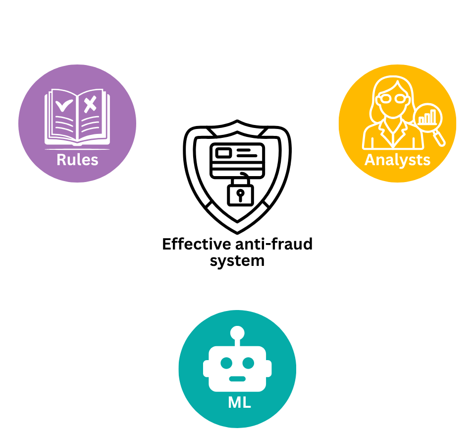
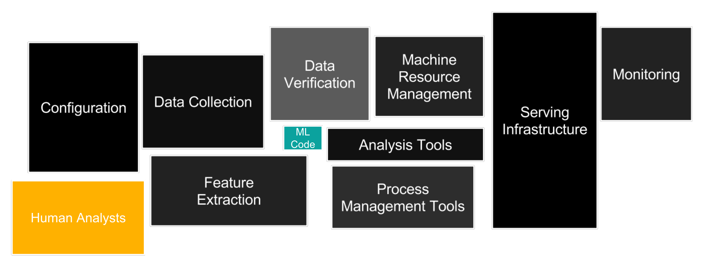
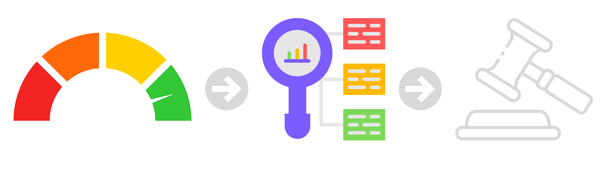
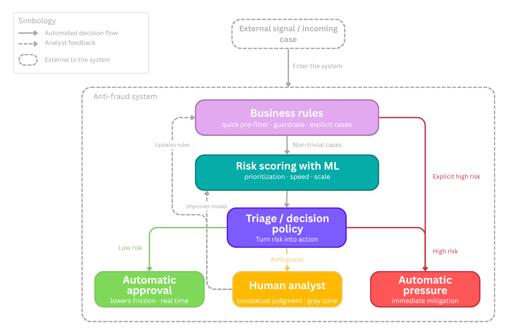
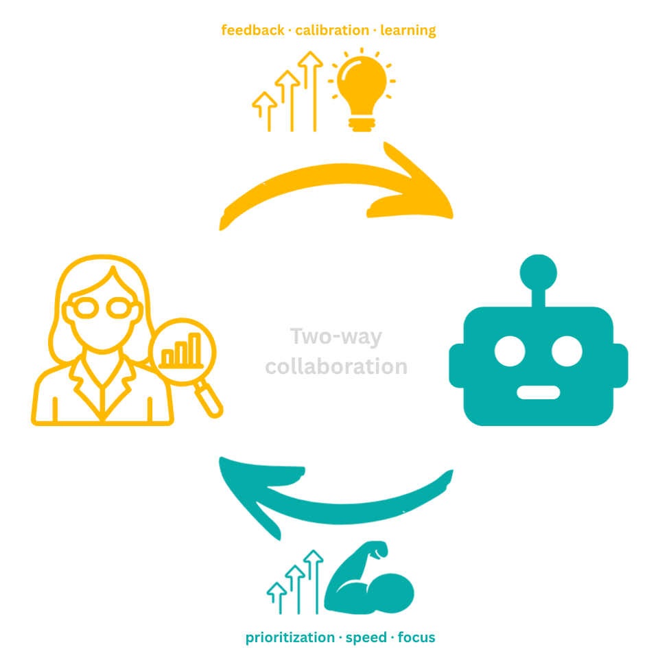
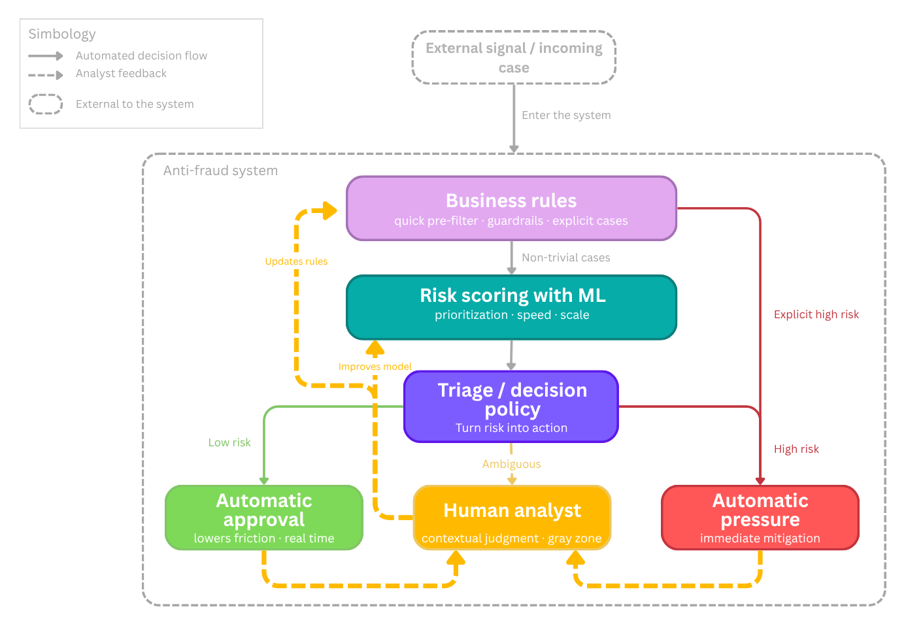
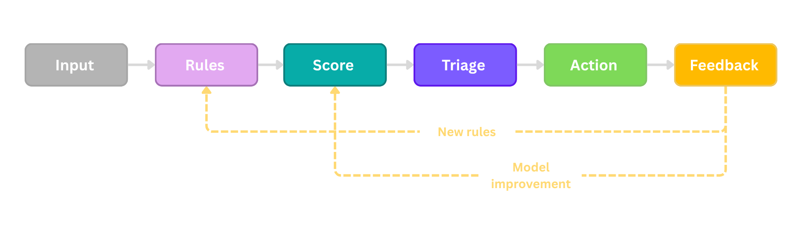

# Designing fraud-prevention systems that keep analysts in the loop
### A technical article extending the Nerdearla Chile 2026 [talk](https://nerdearla.com/chile/schedule/prevencion-de-fraude-machine-learning-y-patrones-de-diseno-manten-a-tus-analistas-en-el-loop/)

## Abstract

This article extends the Nerdearla Chile 2026 talk "Fraud prevention, machine learning, and design patterns: keep your analysts in the loop." The main claim is that fraud prevention should be treated as an **ML-enabled software-architecture problem**, not only as a classification problem. In real operations, rules, machine learning, operational policy, analyst work, and platform engineering all shape outcomes. Looking only at model performance hides the socio-technical nature of the system.

The article develops a design-pattern proposition for **ML-enabled Human-in-the-Loop (HIL) Triage**. The proposed pattern uses rules for explicit cases, machine learning for scoring and prioritization, policy for routing and action selection, and expert analysts for ambiguous cases and structured feedback. The discussion connects this architecture to the literature on software architecture for ML systems, human-in-the-loop design, design patterns for AI-based systems, learning to defer, alert prioritization, reliable machine learning, and platform engineering. More broadly, the article situates the proposal within the wider human-in-the-loop machine-learning literature, where humans may participate as reviewers, collaborators, or teachers rather than only as post hoc annotators (Mosqueira-Rey et al., 2023).

## 1. Introduction

The conference talk that accompanies this repository was intentionally concise. A short slot is useful for communicating the core intuition, but it cannot fully explain the broader software-architecture background, the design-pattern framing, the operational consequences, or the connections to MLOps and platform engineering. This article exists to fill that gap.

The central thesis is straightforward: robust fraud-prevention systems are hybrid systems. They rarely succeed as purely manual workflows, because the volume of traffic and the speed of attack make full manual review infeasible. They also rarely succeed as purely automatic systems, because high-stakes decisions must account for ambiguity, changing attacker behavior, incomplete labels, asymmetric costs, and governance constraints. The most resilient architecture combines deterministic controls, statistical scoring, decision policy, and expert human judgment.

That claim is not merely organizational. It is architectural. Production machine-learning systems already require supporting software, data pipelines, monitoring, deployment structures, and cross-functional engineering practices (Sculley et al., 2015; Amershi et al., 2019; Lewis, Ozkaya, & Xu, 2021; Nazir, Bucaioni, & Pelliccione, 2024). In fraud prevention, the surrounding system also includes analysts, decision queues, escalation paths, structured review outcomes, and operational feedback loops. The unit of design is therefore not the model in isolation, but the socio-technical system in which model outputs, human judgment, workflow, and institutional decision-making interact to convert signals into action (Dobbe & Wolters, 2024; Salwei & Carayon, 2022) (Fig. 1).

**Fig. 1.** A conceptual overview of the pattern: effective fraud systems are built from the interaction of rules, machine learning, and expert analysts rather than any one component in isolation.

Here (Fig. 1), we capture the argument in its simplest form. Fraud systems benefit from three complementary capabilities. Rules encode explicit knowledge and guardrails. Machine learning compresses heterogeneous signals into scores or rankings. Analysts contribute judgment, novelty detection, and feedback. The point of the pattern is not to declare one of those capabilities superior; it is to design their interaction well.

## 2. Why fraud prevention becomes an architecture problem

Fraud prevention is not a stable prediction problem in which one optimizes a model once and then serves it indefinitely. In practice, fraud systems tend to combine rules, supervised models, anomaly detection, and human investigation because no single technique fully handles novelty, delayed labels, and operational constraints. Carcillo et al. (2021) describe a typical fraud detection system as a multi-layer control structure that can include both automated and human-supervised components, while Hernandez Aros et al. (2024) show that the literature still relies on a wide mix of supervised, unsupervised, deep-learning, and other approaches rather than a single dominant recipe.

First, attackers adapt. Bolton and Hand (2002) already emphasized that fraud detection is a continuously evolving discipline because once a detection method becomes known, criminals change strategy. Carcillo et al. (2021) make the same point in the credit-card setting, where customer behavior changes over time and fraudsters adapt to the detection techniques themselves. Lunghi et al. (2023) extend this into the adversarial-learning literature, where fraud detection is treated as a security-sensitive environment shaped by concept drift, streaming constraints, limited observability, and hostile adaptation.

Second, labels are delayed and imperfect. Carcillo et al. (2021) note that fraud labels are usually known only a posteriori, either because a customer complains or because an investigation confirms the case, and that not all labels are available immediately. Lunghi et al. (2023) likewise describe real-world fraud detection as a delayed-feedback setting in which suspicious transactions are often analyzed by human investigators before a card is blocked. This means the system is not simply predicting a fixed ground truth; it is also acting inside the environment that later generates the labels used for learning, evaluation, and retraining.

Third, error costs are asymmetric. Bolton and Hand (2002) describe fraud detection as a ranking and suspicion-scoring problem in which investigative attention must be concentrated on the most suspicious cases because it is too expensive to investigate everything. They also stress that prevention and detection involve compromises between expense, inconvenience, and effectiveness. Hernandez Aros et al. (2024) similarly note that false fraud alarms, misclassification costs, and timely detection remain central practical difficulties in financial-fraud detection. In other words, the system is not optimizing a neutral statistical objective. It is managing a policy trade-off between missed harm and unnecessary friction.

Fourth, many decisions are time-sensitive. Bolton and Hand (2002) argue that fraud must be detected as quickly as possible once prevention has failed, and that suspicion scores should be ranked so investigation can focus on the most urgent or suspicious records. Lunghi et al. (2023) show that fraud detection often operates online and under streaming constraints, where timing affects both attacks and defenses. Carcillo et al. (2021) add that real fraud systems are layered and partially human-supervised, which means architecture determines which cases can be handled automatically, which must be escalated, and how scarce analyst attention is reserved for the ambiguous zone.

These properties help explain why the literature on ML-enabled software systems has moved from model-centric discussions toward more system-centric and architecture-centric thinking. Muccini and Vaidhyanathan (2021) argue that ML-based systems require dedicated architecting practices beyond those of traditional software alone. Lewis, Ozkaya, and Xu likewise (2021) frame ML systems as end-to-end systems that must be developed, monitored, maintained, and evolved with architecture in mind, while Nazir et al. (2024) show that current architecting guidance increasingly focuses on lifecycle, infrastructure, quality, and integration concerns rather than only on the learned component.

## 3. From hidden technical debt to ML-enabled fraud systems

Sculley et al. (2015) famously argued that much of the real cost of ML systems lies outside the model itself. Data dependencies, feature extraction, configuration, serving, monitoring, and process tooling all create hidden technical debt (Fig. 2). That insight is especially powerful in fraud prevention because it helps expose a misleading simplification: a fraud model is never the whole fraud system.

**Fig. 2.** System anatomy for fraud operations: the model lives inside a wider production environment made of data, software, infrastructure, monitoring, and expert human work. Adapted from Sculley et al. (2015)

We adapt the system-anatomy perspective to fraud operations. It places the learned component inside a wider environment of data flows, serving infrastructure, process tools, monitoring, and human work. This matters because many operational failures appear at the boundaries. A feature outage, a bad integration, a misleading analyst view, or a monitoring blind spot can be just as damaging as a weak model.

The same system view should shape the planning phase, not only post-deployment troubleshooting.

**Fig. 3.** Planning view of an ML-enabled fraud system: business context, software architecture, traditional software, ML development, human expertise, and platform concerns should be co-designed. Adapted from Lewis, Ozkaya & Xu (2021), Andersen, & Maalej (2024), and Kästner (2025).

We broaden the lens from runtime anatomy to planning in Fig. 3. Business requirements, conventional software, ML development, expert review, and platform infrastructure should be designed together. Lewis, Ozkaya, and Xu (2021) treat software architecture as the central organizing activity for ML-enabled systems, not as a one-time diagram produced before implementation. In that view, architecture receives business context and system requirements, decomposes the system into distinct component lanes, and coordinates how those lanes will evolve together. The bidirectional arrows are important because they show that development is not a one-way handoff. When teams encounter problems in software engineering, model development, data pipelines, quality assurance, or operations, those issues flow back to architecture so they can be discussed centrally and propagated across the rest of the system. Architecture helps prevent mismatch between teams that would otherwise design in parallel but drift apart in assumptions, constraints, and quality goals.

The rest of the figure 3 also helps clarify why ML systems must be planned as products rather than isolated models. The traditional component lane represents APIs, business logic, integrations, and interfaces. The ML lane represents model requirements, data engineering, model development, and quality assurance, and it produces not only a trained model but also the supporting data pipeline. Lewis, Ozkaya, and Xu (2021) use this planning view to motivate co-architecting and co-versioning: the system side and the model-development side must be coordinated, and the deployed model must remain traceable to the data, parameters, and evaluation artifacts that produced it. The infrastructure and platform lane wraps the whole system with governance, monitoring, scalability, security, and deployment automation, all of which matter because ML components are data-dependent and degrade differently from conventional software. In our adaptation, the added human lane makes explicit what fraud operations often leave implicit: expert review is not an afterthought but another component that must be designed and integrated from the beginning.

## 4. Why this repository proposes a design pattern

The architecture discussed here is not a one-off diagram. It is proposed as a reusable response to a recurring class of problems. In design-pattern terms, that means specifying context, forces, solution, and consequences.

Pattern literature for AI and ML systems is still maturing. Washizaki et al. (2020) documented recurring architecture and design patterns for machine-learning systems. Heiland, Hauser, and Bogner (2023) expanded the pattern repository for AI-based systems. Järvenpää et al. (2024) focused on reusable architectural tactics for ML-enabled systems. Cruz et al. (2023) reinforced the importance of architecture rationale and evaluation. Taken together, these works suggest that teams need more explicit and reusable architecture knowledge for ML-enabled systems. Andersen and Maalej (2024) make that point especially concrete for human-in-the-loop settings: they frame HIL as a software-engineering design space and compile a catalog of reusable HIL patterns spanning data preparation, training, operation, monitoring, and explanation. Their work is particularly relevant here because it shows that human participation can itself be treated as a pattern concern rather than as an informal fallback around an otherwise automated model.

That is exactly the motivation for formalizing an ML-enabled HIL triage pattern for fraud. The broader HIL-ML literature strengthens that move. Mosqueira-Rey et al. (2023) describe human-in-the-loop machine learning as a family of approaches, including active learning, interactive machine learning, and machine teaching, that differ in how human expertise enters and shapes the loop. Fraud operations are closer to that richer view than to a narrow image of humans appearing only after the model has already made a decision. Andersen and Maalej (2024) also help make the operational implication clearer: HIL is not limited to model training, but extends into deployed-system patterns such as recommendation support, active moderation, corrective feedback, continuous learning, and explanation. That operational orientation maps closely to fraud review queues, analyst overrides, case escalation, and feedback capture.

**Fig. 12.** Pattern framing for ML-enabled human-in-the-loop fraud triage: context, forces, reusable solution, consequences, and related lineage. Synthesized from Lakshmanan, Robinson, & Munn (2020), Andersen & Maalej (2024), Heiland et al. (2023), Cruz et al. (2023), and Järvenpää et al. (2024).

We summarize that pattern view in Fig. 12. The relevant context is a fraud operation in which review demand exceeds analyst capacity, some cases require real-time action, attackers adapt, and error costs are asymmetric (Bolton & Hand, 2002; Carcillo et al., 2021; Jalalvand et al., 2024; Ghadermazi, Shah, & Jajodia, 2024). The forces in tension include speed versus caution, customer friction versus missed fraud, autonomy versus control, and expertise versus capacity (Bolton & Hand, 2002; Jalalvand et al., 2024; Alves et al., 2025). The reusable solution is to combine rules, scoring, policy, analyst review, and feedback loops, which is consistent with both the broader HIL-ML literature and more specific HIL pattern catalogues for ML-based systems (Mosqueira-Rey et al., 2023; Andersen & Maalej, 2024). The positive consequences include better use of scarce analyst attention, lower friction on clearly low-risk traffic, and stronger governance through an explicit separation between score and policy (Andersen & Maalej, 2024; Ghadermazi, Shah, & Jajodia, 2024; Alves et al., 2025). The costs include architectural complexity, calibration work, queue-management overhead, and traceability or versioning obligations (Lewis, Ozkaya, & Xu, 2021; Cruz et al., 2023; Nazir, Bucaioni, & Pelliccione, 2024).

This framing is useful because it turns the talk from a general exhortation into a reusable architectural idea. It clarifies when the pattern is appropriate, why it is needed, and what trade-offs it carries.

## 5. The anatomy of the proposed pattern

The proposed pattern can be understood as a series of transformations that move from signal to action.

The first important transformation is from observation to score. The model consumes features and estimates risk. The second is from score to policy. A separate policy layer interprets the score in light of operational goals and constraints. The third is from policy to action, where the system approves, blocks, escalates, or routes a case to review.

**Fig. 4.** Score-to-policy-to-action pipeline: the model produces a risk score, a policy layer translates that score into operational logic, and only then does the system take action.

The separation in Figure 4 is essential. It avoids the common but dangerous shortcut of treating the model score as if it were already a business decision (Chen et al., 2022). In operational settings, scores often need to be combined with guardrails, analyst saturation, time sensitivity, customer value, regional policy, and legal requirements (Kästner, 2025). Those are policy concerns, not model parameters.

Once score and policy are separated, the architecture can be stated more precisely. Fig. 5 summarizes that runtime logic as a reference pattern: business rules handle explicit cases, ML scores the non-trivial ones, and the policy layer decides whether the system should approve, escalate, or mitigate.

**Fig. 5.** Reference architecture of the ML-enabled HIL Triage pattern: business rules filter explicit cases, ML scores the non-trivial cases, and a decision policy routes them to approval, analyst review, or automatic mitigation.

Deterministic rules sit near the entry point because some cases are explicit enough to justify immediate handling. Non-trivial cases reach the scoring layer. The policy layer then converts score into action. Low-risk cases may be approved automatically to reduce friction. Clear high-risk cases may be mitigated automatically. Ambiguous cases move to analysts.

This structure has several advantages. It respects the strengths of each component, it separates inference from governance, and it creates a natural place to encode escalation logic. It also aligns well with the broader literature on learning to defer and selective intervention, where the goal is not merely to classify but to decide which cases should stay with the model and which should be routed to experts (Alves et al., 2025).

## 6. Analysts are a runtime component, not a fallback afterthought

A recurring weakness in ML system design is to treat human review as a vague fallback step. The pattern proposed here argues for the opposite. Analysts should be considered explicit runtime components of the architecture.

**Fig. 6.** Bidirectional collaboration between analysts and ML: models provide prioritization, speed, and focus, while analysts contribute feedback, calibration, contextual judgment, and learning.

We represent that relationship in Fig. 6 as a two-way collaboration. The model accelerates prioritization and reduces search cost. Analysts supply interpretation, exception handling, escalation judgment, and feedback. That feedback is not just an annotation activity for offline training. It is part of the production operation. Seen through the HIL literature, analysts are not merely annotators. They may act as reviewers, collaborators, or teachers depending on where intervention happens and how their expertise is captured (Mosqueira-Rey et al., 2023). Related work on anomaly reasoning and management reaches a similar conclusion from the tooling side: the goal is not detection alone, but support for explanation, action, and iterative investigation in production (Ding et al., 2023). So, you we put emphasis on this in Fig. 7.

**Fig. 7.** Closed-loop HIL triage with explicit feedback paths: analyst outcomes feed rule maintenance and model improvement, turning review into a learning mechanism rather than an operational dead end.

Analyst outcomes should feed both rule maintenance and model improvement. That means review results must be structured enough to support relabeling, rule creation, threshold changes, and post-incident analysis. Kadam (2024) helps sharpen this point by treating human-in-the-loop fraud feedback not only as ad hoc review, but as feedback that can be propagated and reused. This is especially important when the system encounters weakly characterized or unknown attacks. Expert-in-the-loop approaches to open-set recognition suggest that human review becomes most valuable at the boundary where the model faces novelty and uncertainty rather than well understood cases (Yuan et al., 2026).

The yellow return paths from automatic approval and automatic pressure to the human-analyst box make that point more explicit. Analysts should not review only the ambiguous cases routed to them in real time. They should also be able to audit samples of cases that were automatically resolved on either side, both to detect false positives and false negatives and to decide whether the underlying label, threshold, rule, or routing logic should be revised. In production, that kind of retrospective review is valuable because many important errors become visible only after deployment, when the system encounters edge cases, data drift, or changing operating conditions and teams need explicit error monitoring rather than trust in aggregate metrics alone (Tan, Padmanabhan, & Mallya, 2026; Chen et al., 2022). Structured review of automatically handled cases can then be turned into corrections or additional labels, which Andersen and Maalej (2024) describe as a core HIL mechanism across operation and monitoring stages. In fraud settings, Kadam (2024) makes the same idea more concrete by showing that human feedback can be propagated and reused, improving robustness, recall, and performance on unseen fraud patterns rather than remaining a one-off operational intervention. When those reviewed outcomes are captured carefully, they also improve relabeling quality and strengthen future training data, especially in settings where only a subset of predictions can be manually verified (Chen et al., 2022).

Figure 8 presents the same idea in a compact operational form.

**Fig. 8.** Operative learning in ML-enabled HIL triage: downstream feedback should update both rules and models so that operations become a source of system learning.

At its simplest, the pattern is an operating loop rather than a pipeline. The system should not end with action alone. Once outcomes are observed, feedback should flow back into both rules and models so that operations become a source of learning.

Operationalization also requires a concrete analyst workbench.

**Fig. 9.** Analyst workbench for HIL fraud triage: ranked cases, risk bands, reason codes, SLA timers, and structured feedback turn the architecture into an operational review system. Synthesized from Jalalvand et al. (2024), Ghadermazi et al. (2024), and Alves et al. (2025).

A workbench like the one shown in Fig. 9 turns the architecture into an operational review system. Alert prioritization research repeatedly highlights the importance of workload, context, skill, assignment, and review efficiency (Jalalvand et al., 2024; Ghadermazi, Shah, & Jajodia, 2024). Learning-to-defer research likewise shows that expert availability and heterogeneity matter for system performance (Alves et al., 2025). A practical analyst interface should therefore expose ranked cases, top signals, SLA pressure, action controls, and structured feedback fields. Without those elements, the architecture remains abstract and difficult to operate. This is also consistent with human-AI interaction guidance, which emphasizes communicating uncertainty, supporting efficient oversight, and making intervention understandable at the point of use (Amershi et al., 2019). Industry case studies point in the same direction. Uber's Project RADAR used humans in the loop to validate and operationalize candidate fraud rules rather than treating analysts as a purely manual backup layer (Zelvenskiy et al., 2022).

## 7. Evaluation must fit the socio-technical system

One of the strongest consequences of the architecture view is that evaluation has to widen (Lewis, Ozkaya, & Xu, 2021; Nazir, Bucaioni, & Pelliccione, 2024). A system that routes decisions across automation and human review should not be judged only with a single model metric, because the relevant unit of evaluation is the broader socio-technical system in which model outputs interact with workflow, human interpretation, and organizational action (Dobbe & Wolters, 2024; Salwei & Carayon, 2022).

**Fig. 10.** Metrics and trade-offs for ML-enabled human-in-the-loop fraud triage: model quality, queue operations, runtime quality, and policy behavior should be evaluated together. Synthesized from Lewis et al. (2021), Jalalvand et al. (2024), Ghadermazi et al. (2024), Alves et al. (2025), Chen et al. (2022), and Tan et al. (2026).

Taken together, these dimensions define a broader evaluation frame for the system (Fig. 10), one that reflects not only model behavior but also the wider socio-technical conditions under which the system is used and interpreted (Dobbe & Wolters, 2024; Fazelpour, 2025). Data and input quality matter because distribution shifts, missing features, or stale inputs can damage performance before the model even acts (Lewis, Ozkaya, & Xu, 2021; Chen et al., 2022; Kästner, 2025). Model and decision quality still matter, but metrics such as precision at the top of the queue, recall on confirmed fraud, calibration, and deferral rate are often more informative than a single aggregate score (Chen et al., 2022; Alves et al., 2025). Queue and analyst operations matter because backlog size, review latency, agreement, workload, and SLA behavior shape the system’s real effectiveness in practice (Jalalvand et al., 2024; Ghadermazi, Shah, & Jajodia, 2024; Alves et al., 2025). Runtime and platform quality matter because latency, error rates, uptime, and observability determine whether the decision system remains usable in production (Lewis, Ozkaya, & Xu, 2021; Tan, Padmanabhan, & Mallya, 2026).

The policy box in Fig. 10 is equally important. Approval, review, and block rates are not only downstream consequences of the model. They are part of what the organization is deliberately choosing through its operating policy, because predictions still have to be translated into product behavior, business logic, and action (Chen et al., 2022). This is another reason score and policy should be treated separately: the model estimates risk, but the organization decides how that risk will be acted on under its own constraints, quality goals, and operating conditions (Lewis, Ozkaya, & Xu, 2021; Kästner, 2025).

The trade-off strip at the bottom is not decorative. It reflects the fact that fraud systems move along architectural and operational frontiers rather than optimizing a single objective, and that the meaning of those trade-offs depends on the broader system in which the model is embedded (Fazelpour, 2025). Speed can conflict with caution, fraud catch rate with customer friction, coverage with analyst capacity, and adaptability with auditability (Chen et al., 2022; Jalalvand et al., 2024; Alves et al., 2025). More broadly, architecting ML-enabled systems requires making heterogeneous quality concerns, uncertainty, and decision trade-offs explicit rather than pretending they disappear at deployment time (Lewis, Ozkaya, & Xu, 2021; Nazir, Bucaioni, & Pelliccione, 2024; Cruz et al., 2023; Kästner. 2025).

## 8. MLOps and platform engineering are part of the argument

The pattern does not end at runtime routing. It has an operational lifecycle in which monitoring and user feedback inform model maintenance and evolution, including retraining (Lewis, Ozkaya, & Xu, 2021). In production, those same signals should also support data curation, feature maintenance, and policy revision rather than being treated as isolated operational artifacts (Tan, Padmanabhan, & Mallya, 2026; Kästner, 2025). Fig. 11 summarizes that broader lifecycle, linking offline build activities with online operation, monitoring, feedback capture, and iterative revision. The upper part of the figure represents the offline build loop of data capture, feature generation, training, and evaluation. The lower part represents the online operating loop, where deployment, monitoring, analyst review, and structured feedback create the conditions for maintenance and adaptation.

**Fig. 11.** MLOps feedback lifecycle for ML-enabled HIL fraud systems: runtime monitoring and analyst feedback support data curation, model improvement, and policy revision. Adapted from Lewis, Ozkaya, & Xu (2021), extended with platform-engineering concepts from Tan, Padmanabhan, & Mallya (2026), and specialized for fraud feedback loops using Kadam (2024).

The side loops are the most important part of the diagram, because they show why feedback should not be collapsed into a single retraining arrow. Some signals should improve the dataset or feature pipeline, some should drive model improvement, and some should revise rules, thresholds, or routing policy. Data and feature plumbing are part of that same architectural story (Lin & Ryaboy 2013). Konieczny (2025) documents recurring data-engineering patterns for dependable ingestion, transformation, lineage, and pipeline quality, and those concerns map directly onto the data-capture and feature-generation stages shown here. Mosqueira-Rey et al. (2023) help explain why the diagram contains more than one return path: in HIL systems, human intervention may serve different roles, from annotation to interactive steering to teaching, so collapsing all feedback into retraining would hide important design distinctions.

This is consistent with the literature. Lewis, Ozkaya, and Xu (2021) emphasize monitorability, maintenance, and evolution. Lewis, Bellomo, and Ozkaya (2021) discuss mismatch between assumptions made by different roles and system parts. Tan, Padmanabhan, and Mallya (2026) frame platform support as an important way to reduce accidental complexity and create repeatable paths for deployment, observability, and governance. Kadam (2024) brings the fraud-specific feedback loop into that broader lifecycle.

The platform foundation shown in Figure 11 also matters. Versioning, feature storage, registry services, observability, and governance are not optional conveniences for mature systems. They are part of what makes the architecture maintainable.

## 9. What the pattern improves, and what it costs

The proposed pattern improves several things at once. It uses analyst attention more efficiently by reserving human review for the cases where human judgment creates the most value, which is consistent with alert-prioritization and learning-to-defer work on workload, expertise, and capacity constraints (Jalalvand et al., 2024; Alves et al., 2025). It reduces friction on clearly low-risk traffic while making it easier to intervene quickly on clear high-risk cases, which is one reason prioritization and routing logic matter in operational systems rather than only in model evaluation (Jalalvand et al., 2024; Kästner, 2025). It separates inference from governance by giving policy its own architectural place, instead of treating model output as if it were already the organization’s decision (Chen et al., 2022; Lewis, Ozkaya, & Xu, 2021). It also makes learning more explicit by turning review outcomes into inputs for rule and model improvement, aligning the runtime system with broader HIL patterns of feedback, correction, and continued adaptation (Andersen & Maalej, 2024; Mosqueira-Rey et al., 2023).

Those benefits come with costs. The architecture has more moving parts than a pure scoring service, and ML-enabled systems already create substantial integration, data, and evolution challenges even before the human lane is added (Lewis, Ozkaya, & Xu, 2021; Nazir, Bucaioni, & Pelliccione, 2024). Queue behavior must be monitored because backlog, latency, analyst workload, and assignment quality shape the real system outcome, not just the model’s score distribution (Jalalvand et al., 2024; Ghadermazi, Shah, & Jajodia, 2024). Decision logic must be versioned and auditable, and human feedback must be structured and governed, because traceability, co-versioning, and explicit decision rationale are part of reliable ML-enabled architecture rather than optional extras (Lewis, Ozkaya, & Xu, 2021; Cruz et al., 2023). Different teams, such as software engineers, data scientists, risk operators, and analysts, must also coordinate around shared system behavior, which is exactly the kind of trade-off-rich architectural work emphasized in both ML-enabled systems research and general architecture literature (Nazir, Bucaioni, & Pelliccione, 2024; Richards & Ford, 2025). This is precisely why the design-pattern framing is useful: it describes not only the solution, but also the costs of adopting it.

### Anti-patterns worth naming

Several anti-patterns follow naturally from this discussion.

**Letting the score become policy.** When a raw model score directly triggers business action without an explicit policy layer, governance becomes opaque, because the system no longer makes clear where inference ends and organizational decision-making begins. A separate policy layer is useful precisely because ML-enabled systems need architectural separation of concerns rather than tight coupling between business logic and inference (Lewis, Ozkaya, & Xu, 2021; Washizaki et al., 2020). Threshold changes also become risky in tightly coupled designs, since teams lose the ability to distinguish whether a failure belongs to the model, the surrounding business logic, or the interaction between both parts (Washizaki et al., 2020). The remedy is the separation described in Section 5: score estimates risk; policy decides what to do about it. That separation is consistent with the recurring ML architecture pattern of distinguishing business logic from ML models, and with product-oriented ML engineering that treats prediction as only one step inside a larger decision system.

**Treating analysts as unstructured exception handling.** If reviewers leave only free-text notes and the system captures no structured outcome data, the feedback loop collapses. In HIL systems, human intervention can play very different roles, including annotation, interactive steering, and machine teaching, so the architecture needs to capture that intervention explicitly rather than leaving it implicit in notes (Mosqueira-Rey et al., 2023). The review lane then generates operational cost but no reusable signal. By contrast, HIL pattern work treats human feedback as an explicit part of operation and monitoring, not as an informal fallback around an otherwise autonomous model (Andersen & Maalej, 2024). Structured fields for outcome, reason code, confidence, and suggested action are what turn review into learning, because they make the analyst contribution reusable for correction, adaptation, and future improvement rather than leaving it trapped inside case-by-case exception handling.

**Building the model while leaving operations underspecified.** A common failure mode is to invest heavily in data science while treating the analyst interface, queue design, and escalation logic as afterthoughts. Alert-prioritization research repeatedly shows that increasing alert volume overwhelms analysts and creates alert fatigue, so operational design is not peripheral to system performance (Jalalvand et al., 2024). Workload, time efficiency, analyst fatigue, skill, and contextual review conditions all affect how well the system works in practice, not just how well the model performs in isolation (Jalalvand et al., 2024). The result of underspecifying operations is therefore a high-performing model inside a system that cannot operate it effectively. More broadly, ML-enabled systems require architecture work that covers not only model pipelines but also the system that uses and interacts with ML components, especially for maintenance, evolution, and coordination across teams (Lewis, Ozkaya, & Xu, 2021; Nazir, Bucaioni, & Pelliccione, 2024).

**Ignoring monitorability until something breaks.** Lewis, Ozkaya, and Xu (2021) identify monitorability as a top architectural driver for the maintenance and evolution of ML systems, and they note that ML systems need end-to-end lifecycle support that includes monitoring, maintenance, and evolution. In fraud systems, degradation often appears first as queue overload, rising analyst disagreement, or calibration drift rather than as a dramatic crash, so waiting for obvious failure is itself an anti-pattern (Lewis, Ozkaya, & Xu, 2021; Jalalvand et al., 2024).

**Glue code and pipeline jungles.** Washizaki et al. (2020) identify both glue code and pipeline jungles as recurring ML anti-patterns. Fraud systems are especially vulnerable because they accumulate feature joins, rule engines, risk services, case queues, and alerting layers under delivery pressure. Without platform discipline, traceability, and versioning, those components become fragile and hard to change. (Washizaki et al., 2020; Lewis, Ozkaya, & Xu, 2021; Kästner, 2025).

Taken together, these anti-patterns define the limits of the pattern as clearly as its benefits. The architecture works only if score and policy remain distinct, feedback is structured, and operations are designed and monitored explicitly rather than left implicit in ad hoc practice (Washizaki et al., 2020; Andersen & Maalej, 2024; Lewis, Ozkaya, & Xu, 2021). Their value, then, is not only diagnostic. They also show why the pattern belongs to software architecture: it is a way of making system responsibilities, trade-offs, and failure modes visible across software, data, policy, and human work (Richards & Ford, 2025; Cruz et al., 2023). That broader architectural view is what the next section builds on.

## 10. Why this matters for a new, but important field

A recurring idea across the literature discussed in this article is that ML-enabled software architecture is still a relatively young field. Muccini and Vaidhyanathan (2021) explicitly argue that the community still needs better architecting practices and more clearly defined standards for ML-based software systems. Nazir, Bucaioni, and Pelliccione (2024) reinforce that point by showing that the field is still actively consolidating design challenges, best practices, and architectural design decisions. The community already has important concepts such as hidden technical debt, architecture mismatch, HIL design patterns, monitorability, architecture evaluation, and internal ML platforms, but reusable design knowledge is still being consolidated. At the same time, the wider HIL-ML literature makes clear that human participation is itself a design space rather than a generic fallback (Mosqueira-Rey et al., 2023; Andersen & Maalej, 2024).

Fraud prevention is a useful place to push that field forward because the stakes make the socio-technical nature of ML especially visible. Dobbe and Wolters (2024) argue that ML applications should be understood not only in an algorithmic or data frame, but in a sociotechnical frame that includes human and institutional decisions within the system boundary. Salwei and Carayon (2022) similarly stress that AI is only one element of a larger work system, and that design has to account for workflow, users, technologies, and organizational context together. Kästner (2025) reinforces the same point from a production-engineering perspective by treating machine learning as part of a product and operational system rather than as an isolated model. In lower-stakes domains, teams can sometimes hide the surrounding architecture behind a model score or a dashboard. In fraud operations, the consequences of doing so become obvious very quickly. Decisions affect money, customer experience, investigation load, escalation paths, and organizational risk. That makes fraud a particularly revealing domain for discussing ML-enabled architecture as architecture.

The design-pattern proposition developed here is therefore meant to add one more concrete example to that growing field. It is not the claim that humans-in-the-loop are novel in themselves. Rather, it is the claim that this particular combination of rules, scoring, policy, analyst review, and closed-loop feedback deserves to be documented as a reusable architectural response. That move is consistent with the growing pattern literature for ML-based systems in general (Washizaki et al., 2020; Andersen & Maalej, 2024), and with the broader production-oriented view that ML components should be designed as parts of products and operational systems rather than as isolated models (Kästner, 2025).

## 11. Open questions

Several open questions remain, and they are worth stating clearly.

One open question concerns policy optimization. If scores, analyst capacity, SLA pressure, and business value all matter, what is the best way to define and adapt the routing policy over time?

Another concerns feedback quality. Which analyst signals are most predictive of future system improvement, and how should disagreement between analysts be modeled? Learning-to-defer research suggests that expert heterogeneity and capacity constraints matter (Alves et al., 2025); in fraud operations, those effects are likely to interact further with role-specific responsibilities and queue dynamics, which deserve more direct study. Expert-in-the-loop work on unknown attack detection via open-set recognition points to one promising direction, but similar ideas remain underexplored in fraud operations (Yuan et al., 2026).

A third open question concerns architecture evaluation. Scenario-based architecture evaluation has already been discussed for ML-enabled systems (Cruz et al., 2023; Nazir, Bucaioni, & Pelliccione, 2024), but there is still room for more domain-specific methods tailored to operational fraud settings. In this domain, useful evaluation scenarios would not stop at generic quality attributes. They would explicitly test queue saturation, feature outages, delayed labels, and adversarial shifts, because those are the kinds of conditions that determine whether a fraud architecture remains effective after deployment (Jalalvand et al., 2024; Chen et al., 2022; Lunghi et al., 2023).

A fourth open question concerns platform productization. Many organizations still build fraud systems as collections of scripts, dashboards, and services with weak shared abstractions, which makes cross-team coordination, workflow orchestration, and operational visibility harder than they need to be. Lin and Ryaboy (2013) describe this broader “plumbing” problem in large-scale data systems, where workflows span teams and frameworks in ways that become difficult to reason about without stronger shared infrastructure. In ML systems, Tan, Padmanabhan, and Mallya (2026) argue that well-designed internal platforms can provide a more consistent foundation for automation, monitoring, deployment, and developer experience, while Kästner (2025) emphasizes that orchestration, observability, provenance, and infrastructure discipline are part of the product system rather than secondary implementation details. Internal platform engineering for fraud and risk therefore remains an important opportunity.

A fifth open question concerns the role of large language models and generative AI in the analyst workflow. LLM-based components may eventually change how analysts interact with fraud systems by supporting case summarization, natural-language reasoning traces, conversational investigation support, or explanation interfaces. Tan, Padmanabhan, and Mallya (2026) show that LLM-powered systems introduce distinctive concerns around interface design, validation, observability, safety guardrails, and evaluation, which means they should not be added as thin interface layers without architectural planning. In fraud operations, the key question is not simply whether LLMs will appear, but how they can be integrated without weakening the structured feedback loops, auditability, and governance on which the proposed pattern depends. At this stage, that question remains more of a design agenda than a settled answer.

## 12. Conclusion

This article has argued that fraud prevention should be designed as an ML-enabled socio-technical architecture. System behavior is produced not by the model alone, but by the interaction of rules, machine learning, analyst work, policy, and platform support. Robust design therefore requires more than a strong classifier. It requires explicit separation between score and policy, deliberate routing of ambiguous cases to expert review, structured feedback loops, evaluation that extends beyond accuracy, and operational practices that connect runtime behavior back to data, models, and policy.

The proposed pattern can be stated simply. Use rules where the organization already has explicit knowledge and firm guardrails. Use machine learning where prioritization and signal compression create scale. Use analysts where context, exception handling, and judgment matter. Keep score separate from policy. Capture feedback in a structured form. Design the surrounding platform so that the system can be observed, revised, and improved over time.

More broadly, the point is not only that fraud systems need humans in the loop. It is that this combination of rules, scoring, policy, analyst review, and closed-loop learning deserves to be treated as a reusable architectural response for a high-stakes domain. That is the argument presented in the talk and developed in greater depth in this article.

## References

Amershi, S., Begel, A., Bird, C., DeLine, R., Gall, H., Kamar, E., Nagappan, N., & Nushi, B. (2019). *Software engineering for machine learning: A case study*. In **2019 IEEE/ACM 41st International Conference on Software Engineering: Software Engineering in Practice (ICSE-SEIP)** (pp. 291-300). IEEE. https://doi.org/10.1109/ICSE-SEIP.2019.00042

Amershi, S., Weld, D., Vorvoreanu, M., Fourney, A., Nushi, B., Collisson, P., Suh, J., Iqbal, S. T., Bennett, P. N., Inkpen, K., Teevan, J., Kikin-Gil, R., & Horvitz, E. (2019). *Guidelines for human-AI interaction*. In **Proceedings of the 2019 CHI Conference on Human Factors in Computing Systems**. Association for Computing Machinery. https://doi.org/10.1145/3290605.3300233

Alves, J. V., Leitão, D., Jesus, S., Sampaio, M. O. P., Liébana, J., Saleiro, P., Figueiredo, M. A. T., & Bizarro, P. (2025). *A benchmarking framework and dataset for learning to defer in human-AI decision-making*. **Scientific Data, 12**, 506. https://doi.org/10.1038/s41597-025-04664-y

Andersen, J., & Maalej, W. (2024). *Design Patterns for Machine Learning-Based Systems With Humans in the Loop*. **IEEE Software, 41**(4), 151-159. https://doi.org/10.1109/MS.2023.3340256

Bolton, R. J., & Hand, D. J. (2002). *Statistical fraud detection: A review*. **Statistical Science, 17**(3), 235-255. https://doi.org/10.1214/ss/1042727940

Carcillo, F., Le Borgne, Y.-A., Caelen, O., Kessaci, Y., Oblé, F., & Bontempi, G. (2021). *Combining unsupervised and supervised learning in credit card fraud detection*. **Information Sciences, 557**, 317-331. https://doi.org/10.1016/j.ins.2019.05.042

Chen, C., Murphy, N. R., Parisa, K., Sculley, D., & Underwood, T. (2022). *Reliable machine learning: Applying SRE principles to ML in production*. O’Reilly Media.

Cruz, P., Ulloa, G., San Martin, D., & Veloz, A. (2023). *Software Architecture Evaluation of a Machine Learning Enabled System: A Case Study*. In **2023 42nd IEEE International Conference of the Chilean Computer Science Society (SCCC)**. IEEE. https://doi.org/10.1109/SCCC59417.2023.10315755

Ding, X., Seleznev, N., Kumar, S., Bruss, C. B., & Akoglu, L. (2023). *From detection to action: A human-in-the-loop toolkit for anomaly reasoning and management*. In **Proceedings of the Fourth ACM International Conference on AI in Finance** (pp. 279-287). Association for Computing Machinery. https://doi.org/10.1145/3604237.3626872

Dobbe, R., & Wolters, A. (2024). T*oward sociotechnical AI: Mapping vulnerabilities for machine learning in context*. Minds and Machines, 34(2), Article 12. https://doi.org/10.1007/s11023-024-09668-y

Fazelpour, S. (2025). *Disciplining deliberation: A socio-technical perspective on machine learning trade-offs*. The British Journal for the Philosophy of Science. Advance online publication. https://doi.org/10.1086/734552

Ghadermazi, J., Shah, A., & Jajodia, S. (2024). *A machine learning and optimization framework for efficient alert management in a cybersecurity operations center*. **Digital Threats: Research and Practice, 5**(2), Article 19. https://doi.org/10.1145/3644393

Heiland, L., Hauser, M., & Bogner, J. (2023). *Design Patterns for AI-based Systems: A multivocal literature review and pattern repository*. In **2023 IEEE/ACM 2nd International Conference on AI Engineering - Software Engineering for AI (CAIN)**. IEEE. https://doi.org/10.1109/CAIN58948.2023.00034

Hernandez Aros, L., Bustamante Molano, L. X., Gutierrez-Portela, F., Moreno Hernandez, J. J., & Rodríguez Barrero, M. S. (2024). *Financial fraud detection through the application of machine learning techniques: A literature review*. **Humanities and Social Sciences Communications, 11**(1), 1-22. https://doi.org/10.1057/s41599-024-03606-0

Hilal, W., Gadsden, S. A., & Yawney, J. (2022). *Financial fraud: A review of anomaly detection techniques and recent advances*. **Expert Systems with Applications, 193**, 116429. https://doi.org/10.1016/j.eswa.2021.116429

Järvenpää, H., Lago, P., Bogner, J., Lewis, G. A., Muccini, H., & Ozkaya, I. (2024). *A synthesis of green architectural tactics for ML-enabled systems*. In **Proceedings of the 46th International Conference on Software Engineering: Software Engineering in Society (ICSE-SEIS '24)** (pp. 130-141). Association for Computing Machinery. https://doi.org/10.1145/3639475.3640111

Jalalvand, F., Chhetri, M. B., Nepal, S., & Paris, C. (2024). *Alert prioritisation in security operations centres: A systematic survey on criteria and methods*. **ACM Computing Surveys, 57**(2), Article 42. https://doi.org/10.1145/3695462

Kadam, P. (2024). *Enhancing financial fraud detection with human-in-the-loop feedback and feedback propagation*. In **2024 International Conference on Machine Learning and Applications (ICMLA)** (pp. 1198-1203). IEEE. https://doi.org/10.1109/ICMLA61862.2024.00185

Kästner, C. (2025). *Machine learning in production: From models to products*. MIT Press. https://mlip-cmu.github.io/book/

Konieczny, B. (2025). *Data engineering design patterns: Recipes for solving the most common data engineering problems*. O’Reilly Media.

Lakshmanan, V., Robinson, S., & Munn, M. (2020). *Machine learning design patterns*. O’Reilly Media.

Lewis, G. A., Bellomo, S., & Ozkaya, I. (2021). *Characterizing and detecting mismatch in machine-learning-enabled systems*. In **2021 IEEE/ACM 1st Workshop on AI Engineering - Software Engineering for AI (WAIN)** (pp. 133-140). IEEE. https://doi.org/10.1109/WAIN52551.2021.00028

Lewis, G. A., Ozkaya, I., & Xu, X. (2021). *Software architecture challenges for ML systems*. In **2021 IEEE International Conference on Software Maintenance and Evolution (ICSME)** (pp. 634-638). IEEE. https://doi.org/10.1109/ICSME52107.2021.00071

Lin, J., & Ryaboy, D. (2013). *Scaling big data mining infrastructure: The Twitter experience*. ACM SIGKDD Explorations Newsletter, 14(2), 6-19. https://doi.org/10.1145/2481244.2481247

Lunghi, D., Simitsis, A., Caelen, O., & Bontempi, G. (2023). *Adversarial learning in real-world fraud detection: Challenges and perspectives*. In **Proceedings of the Second ACM Data Economy Workshop** (pp. 27-33). Association for Computing Machinery. https://doi.org/10.1145/3600046.3600051

Mosqueira-Rey, E., Hernández-Pereira, E., Alonso-Ríos, D., Bobes-Bascarán, J., & Fernández-Leal, Á. (2023). *Human-in-the-loop machine learning: A state of the art*. **Artificial Intelligence Review, 56**, 3005-3054. https://doi.org/10.1007/s10462-022-10246-w

Muccini, H., & Vaidhyanathan, K. (2021). *Software architecture for ML-based systems: What exists and what lies ahead*. In **2021 IEEE/ACM 1st Workshop on AI Engineering - Software Engineering for AI (WAIN)** (pp. 121-128). IEEE. https://doi.org/10.1109/WAIN52551.2021.00026

Nazir, R., Bucaioni, A., & Pelliccione, P. (2024). *Architecting ML-enabled systems: Challenges, best practices, and design decisions*. **Journal of Systems and Software, 207**, 111860. https://doi.org/10.1016/j.jss.2023.111860

Richards, M., & Ford, N. (2025). *Fundamentals of Software Architecture: A Modern Engineering Approach*. " O'Reilly Media, Inc.".

Salwei, M. E., & Carayon, P. (2022). *A sociotechnical systems framework for the application of artificial intelligence in health care delivery*. Journal of Cognitive Engineering and Decision Making, 16(4), 194-206. https://doi.org/10.1177/15553434221097357

Sculley, D., Holt, G., Golovin, D., Davydov, E., Phillips, T., Ebner, D., Chaudhary, V., Young, M., Crespo, J.-F., & Dennison, D. (2015). *Hidden technical debt in machine learning systems*. In **Advances in Neural Information Processing Systems**, 28.

Tan, B. T. W. H., Padmanabhan, S., & Mallya, V. (2026). *Machine learning platform engineering: Build an internal developer platform for ML and AI systems*. Manning.

Washizaki, H., Uchida, H., Khomh, F., & Guéhéneuc, Y.-G. (2020). *Machine learning architecture and design patterns*. **IEEE Software, 37**(4), 76-84. https://doi.org/10.5555/3721041.3721069

Yuan, X., Yu, P., Liu, S., Sun, Z., Zhang, Y., & Xu, J. (2026). *An expert-in-the-loop framework for unknown attack detection via open-set recognition*. **Journal of Computer Security**. Advance online publication. https://doi.org/10.1177/0926227X251414058

Zelvenskiy, S., Harisinghani, G., Yu, T., Ng, E., & Wei, R. (2022). *Project RADAR: Intelligent early fraud detection system with humans in the loop*. Uber Blog. https://www.uber.com/en-CR/blog/project-radar-intelligent-early-fraud-detection/